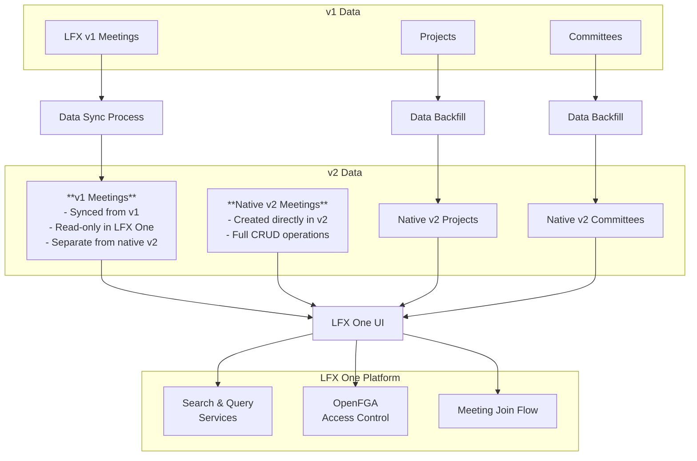
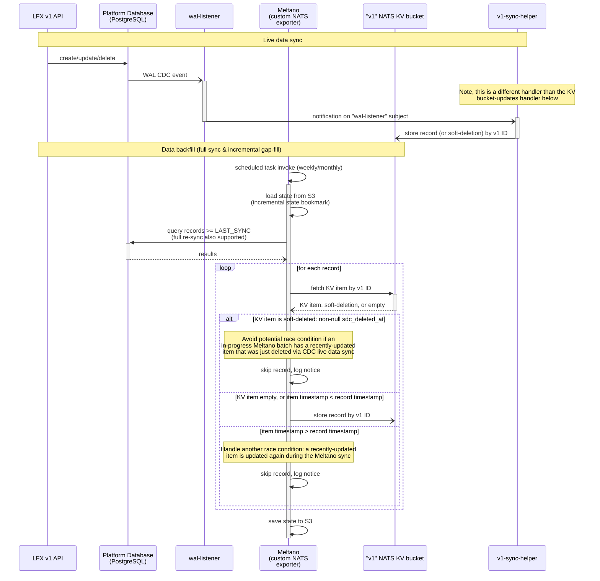
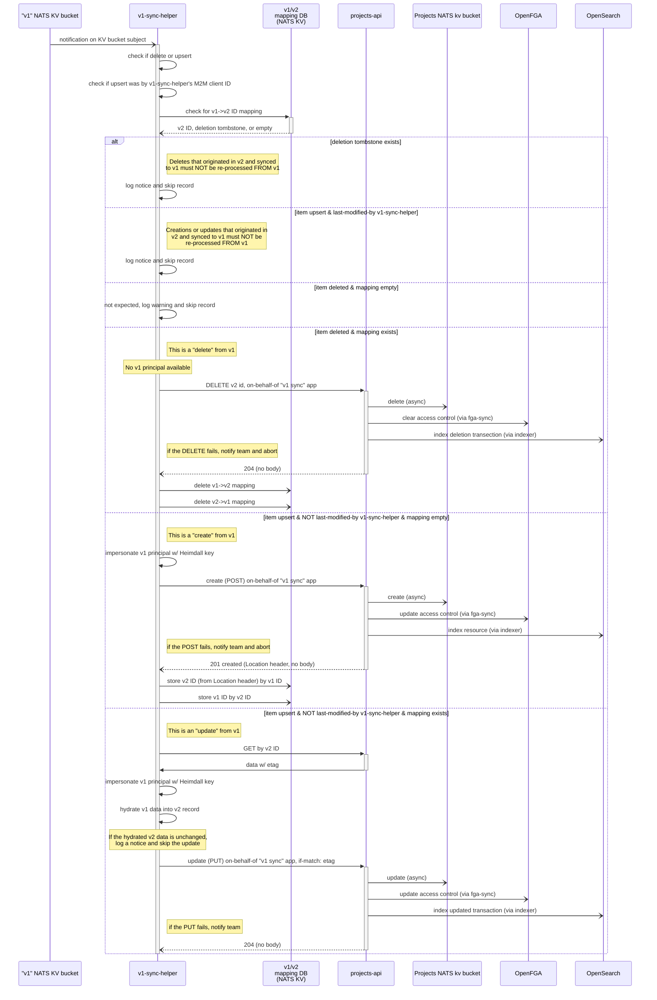
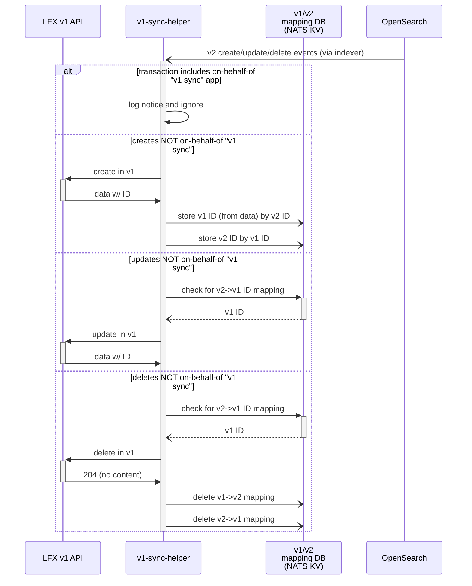

# Data sync components for LFX One

This repository contains tools and services for synchronizing data between LFX v1 and LFX One (v2) platforms. This solution uses Meltano for data replication into the v2 ecosystem, after which a sync helper service handles data mapping and ingestion.

## Overview

Most data entities are synced from v1 into native LFX One entities. A bi-directional sync is also planned.

However, due to the size, complexity, and number of external interactions the LFX Meetings stack has, v1 and v2 meetings will be kept separate, though v1 meetings will be made avaliable as read-only, natively-permissioned entities within LFX One via the query service.

## Prerequisites

- Python 3.12 (managed automatically by uv)
- `uv` package manager installed
- Access to LFX v1 data sources (DynamoDB, PostgreSQL)
- LFX One platform running [via Helm](https://github.com/linuxfoundation/lfx-v2-helm/tree/main/charts/lfx-platform#readme)

Please see each component for further setup instructions.

## Repository structure

This repository contains three main components:

### [Meltano](./meltano/README.md)
Data extraction and loading pipeline that extracts data from LFX v1 sources (DynamoDB for meetings, PostgreSQL for projects/committees) and loads it into NATS KV stores for processing by the v2 platform.

### [v1-sync-helper](./v1-sync-helper/README.md)
Go service that monitors NATS KV stores for replicated v1 data and synchronizes it with the LFX v2 platform APIs, handling data transformation and conflict resolution.

### [Helm charts](./charts/lfx-v1-sync-helper/README.md)
Kubernetes deployment manifests for the v1-sync-helper service, providing scalable deployment options for production environments.

## Architecture Diagrams

Regarding the following diagrams:
- The planned realtime sync for PostgreSQL is included in the diagrams.
- The DynamoDB source (incremental or realtime) is not currently included in the diagrams.
- The planned bidirectional sync (LFX One changes back to v1) is included in the diagrams.
- "Projects API" is representative of most data entities. However, v1 Meetings push straight to OpenSearch and OpenFGA (via platform services)—this is not shown.

### Data extraction/replication sequence diagram

### LFX One data-loading sequence diagram

### LFX One to v1 bidirectional sync

Planned.

### Combined sequence diagram

Several of the sequence diagram participants are shared in the previous diagrams. This next diagram combines the previous diagrams to help show how the data sync works holistically (in its expected, final target state).

```mermaid
sequenceDiagram
    participant lfx_v1 as LFX v1 API
    participant postgres as Platform Database<br/>(PostgreSQL)
    participant wal-listener
    participant meltano as Meltano<br/>(custom NATS<br/>exporter)
    participant v1_kv as "v1" NATS KV bucket
    participant v1-sync-helper
    participant mapping-db as v1/v2<br/>mapping DB<br/>(NATS KV)
    participant projects-api
    participant projects-kv as Projects NATS kv bucket
    participant openfga as OpenFGA
    participant opensearch as OpenSearch

    Note over lfx_v1,v1-sync-helper: Live data sync
    lfx_v1 ->> postgres: create/update/delete
    postgres-)+wal-listener: WAL CDC event
    Note over v1-sync-helper: Note, this is a different handler than the KV<br />bucket-updates handler below
    wal-listener-)+v1-sync-helper: notification on "wal-listener" subject
    deactivate wal-listener
    v1-sync-helper-)-v1_kv: store record (or soft-deletion) by v1 ID

    Note over lfx_v1,v1_kv: Data backfill (full sync & incremental gap-fill)
    meltano->>meltano: scheduled task invoke (weekly/monthly)
    activate meltano
    meltano->>meltano: load state from S3<br/>(incremental state bookmark)
    meltano->>+postgres: query records >= LAST_SYNC<br/>(full re-sync also supported)
    postgres--)-meltano: results
    loop for each record
    meltano->>+v1_kv: fetch KV item by v1 ID
    v1_kv--)-meltano: KV item, soft-deletion, or empty
    alt KV item is soft-deleted: non-null sdc_deleted_at
    Note over meltano: Avoid potential race condition if an<br />in-progress Meltano batch has a recently-updated<br />item that was just deleted via CDC live data sync
    meltano->>meltano: skip record, log notice
    else KV item empty, or item timestamp < record timestamp
    meltano-)v1_kv: store record by v1 ID
    else item timestamp > record timestamp
    Note over meltano: Handle another race condition: a recently-updated<br />item is updated again during the Meltano sync
    meltano->>meltano: skip record, log notice
    end
    end
    meltano->>meltano: save state to S3
    deactivate meltano

    Note over v1_kv,opensearch: Process watched "v1 KV bucket" item-update notification
    v1_kv-)+v1-sync-helper: notification on KV bucket subject
    v1-sync-helper->>v1-sync-helper: check if delete or upsert
    v1-sync-helper->>v1-sync-helper: check if upsert was by v1-sync-helper's M2M client ID
    v1-sync-helper->>+mapping-db: check for v1->v2 ID mapping
    mapping-db--)-v1-sync-helper: v2 ID, deletion tombstone, or empty
    alt deletion tombstone exists
    Note right of v1-sync-helper: Deletes that originated in v2 and synced<br/>to v1 must NOT be re-processed FROM v1
    v1-sync-helper->>v1-sync-helper: log notice and skip record
    else item upsert & last-modified-by v1-sync-helper
    Note right of v1-sync-helper: Creations or updates that originated in<br />v2 and synced to v1 must NOT be<br />re-processed FROM v1
    v1-sync-helper->>v1-sync-helper: log notice and skip record
    else item deleted & mapping empty
    v1-sync-helper->>v1-sync-helper: not expected, log warning and skip record
    else item deleted & mapping exists
    Note right of v1-sync-helper: This is a "delete" from v1
    Note over v1-sync-helper: No v1 principal available
    v1-sync-helper ->>+ projects-api: DELETE v2 id, on-behalf-of "v1 sync" app
    projects-api -) projects-kv: delete (async)
    projects-api -) openfga: clear access control (via fga-sync)
    projects-api -) opensearch: index deletion transection (via indexer)
    Note right of v1-sync-helper: if the DELETE fails, notify team and abort
    projects-api --)- v1-sync-helper: 204 (no body)
    v1-sync-helper -) mapping-db: delete v1->v2 mapping
    v1-sync-helper -) mapping-db: delete v2->v1 mapping
    else item upsert & NOT last-modified-by v1-sync-helper & mapping empty
    Note right of v1-sync-helper: This is a "create" from v1
    v1-sync-helper->>v1-sync-helper: impersonate v1 principal w/ Heimdall key
    v1-sync-helper ->>+ projects-api: create (POST) on-behalf-of "v1 sync" app
    projects-api -) projects-kv: create (async)
    projects-api -) openfga: update access control (via fga-sync)
    projects-api -) opensearch: index resource (via indexer)
    Note right of v1-sync-helper: if the POST fails, notify team and abort
    projects-api --)- v1-sync-helper: 201 created (Location header, no body)
    v1-sync-helper -) mapping-db: store v2 ID (from Location header) by v1 ID
    v1-sync-helper -) mapping-db: store v1 ID by v2 ID
    else item upsert & NOT last-modified-by v1-sync-helper & mapping exists
    Note right of v1-sync-helper: This is an "update" from v1
    v1-sync-helper ->>+ projects-api: GET by v2 ID
    projects-api ->>- v1-sync-helper: data w/ etag
    v1-sync-helper->>v1-sync-helper: impersonate v1 principal w/ Heimdall key
    v1-sync-helper->>v1-sync-helper: hydrate v1 data into v2 record
    Note over v1-sync-helper: If the hydrated v2 data is unchanged,<br/>log a notice and skip the update
    v1-sync-helper ->>+ projects-api: update (PUT) on-behalf-of "v1 sync" app, if-match: etag
    projects-api -) projects-kv: update (async)
    projects-api -) openfga: update access control (via fga-sync)
    projects-api -) opensearch: index updated transaction (via indexer)
    Note right of v1-sync-helper: if the PUT fails, notify team
    projects-api --)- v1-sync-helper: 204 (no body)
    end
    deactivate v1-sync-helper

    Note over lfx_v1,opensearch: Process v2 events
    opensearch -)+ v1-sync-helper: v2 create/update/delete events (via indexer)
    alt transaction includes on-behalf-of "v1 sync" app
    v1-sync-helper->>v1-sync-helper: log notice and ignore
    else creates NOT on-behalf-of "v1 sync"
    v1-sync-helper->>+lfx_v1: create in v1
    lfx_v1->>-v1-sync-helper: data w/ ID
    v1-sync-helper -) mapping-db: store v1 ID (from data) by v2 ID
    v1-sync-helper -) mapping-db: store v2 ID by v1 ID
    else updates NOT on-behalf-of "v1 sync"
    v1-sync-helper->>+mapping-db: check for v2->v1 ID mapping
    mapping-db--)-v1-sync-helper: v1 ID
    v1-sync-helper->>+lfx_v1: update in v1
    lfx_v1->>-v1-sync-helper: data w/ ID
    else deletes NOT on-behalf-of "v1 sync"
    v1-sync-helper->>+mapping-db: check for v2->v1 ID mapping
    mapping-db--)-v1-sync-helper: v1 ID
    v1-sync-helper->>+lfx_v1: delete in v1
    lfx_v1->>-v1-sync-helper: 204 (no content)
    v1-sync-helper -) mapping-db: delete v1->v2 mapping
    v1-sync-helper -) mapping-db: delete v2->v1 mapping
    end
    deactivate v1-sync-helper
```

## License

Copyright The Linux Foundation and each contributor to LFX.

This project’s source code is licensed under the MIT License. A copy of the
license is available in LICENSE.

This project’s documentation is licensed under the Creative Commons Attribution
4.0 International License \(CC-BY-4.0\). A copy of the license is available in
LICENSE-docs.
