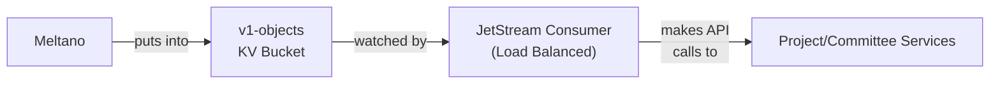

# LFX v1 Sync Helper

The LFX v1 Sync Helper is a Go microservice that synchronizes v1 data from NATS KV buckets to LFX One services via authenticated API calls. It uses a JetStream consumer-based architecture that enables horizontal scaling across multiple service instances for processing v1 data updates.

## Architecture Overview

### Key implementation decisions

1. **KV Bucket Watcher**: Instead of consuming NATS messages directly from streaming data sources, this service watches a NATS KV bucket (`v1-objects`) where v1 data is written by replication jobs (e.g. Meltano)
2. **Direct API Calls**: With the exception of Meetings data, all data is routed into the LFX One platform via the appropriate API services, rather than the v1 Sync Helper writing directly to databases or platform-service queues.
3. **JWT Authentication**: Reuses Heimdall's signing key to create JWT tokens for secure API authentication, supporting user impersonation while also bypassing LFX One permissions—as Heimdall tokens are not just proof of authentication, but are of *authorization*.
4. **Mapping Storage**: Maintains v1-to-v2 ID mappings in a dedicated NATS KV bucket to track state and to avoid introducing "legacy ID" fields in LFX One data models.

### Data Flow

For a more detail view, see the root [README.md](../../README.md) diagrams.



## Horizontal Scaling

The service is designed to scale horizontally across multiple instances using a JetStream consumer with delivery groups:

### Scaling Architecture

Retrieving updates from the KV Bucket handled via a non-ephemeral **JetStream pull consumer**. This has the advantage over an ordinary `kv.Watch()` of distributing messages across multiple instances, similar to how other LFX One services use named queues to scale out processing.

The service attempts to create a JetStream pull consumer with the following properties, if it does not already exist (created by the Helm chart, for instance):

```yaml
name: v1-sync-helper-kv-consumer
stream: KV_v1-objects
filterSubject: "$KV.v1-objects.>"
ackPolicy: explicit
maxDeliver: 3
ackWait: 30s
maxAckPending: 1000
```

### Supported Objects

- **Projects**: LFX project nested hierarchy (PCC / Salesforce)
- **Committees & members**: LFX committees (PCC)

## Configuration

### Environment Variables

| Variable                | Required | Description                                                                       |
|-------------------------|----------|-----------------------------------------------------------------------------------|
| `NATS_URL`              | No       | NATS server URL (default: `nats://nats:4222`)                                     |
| `PROJECT_SERVICE_URL`   | Yes      | Project Service API URL                                                           |
| `COMMITTEE_SERVICE_URL` | Yes      | Committee Service API URL                                                         |
| `HEIMDALL_CLIENT_ID`    | No       | Client ID for JWT claims (default: `v1_sync_helper`)                              |
| `HEIMDALL_PRIVATE_KEY`  | Yes      | JWT private key (PEM format) for v2 services                                      |
| `HEIMDALL_KEY_ID`       | No       | JWT key ID (if not provided, fetches from JWKS)                                   |
| `HEIMDALL_JWKS_URL`     | No       | JWKS endpoint URL (default: cluster service)                                      |
| `AUTH0_TENANT`          | Yes      | Auth0 tenant name (without .auth0.com suffix)                                     |
| `AUTH0_CLIENT_ID`       | Yes      | Auth0 client ID for v1 API authentication                                         |
| `AUTH0_PRIVATE_KEY`     | Yes      | Auth0 private key (PEM format) for v1 API                                         |
| `LFX_API_GW`            | No       | LFX API Gateway URL (default: `https://api-gw.dev.platform.linuxfoundation.org/`) |
| `PORT`                  | No       | HTTP server port (default: `8080`)                                                |
| `BIND`                  | No       | Interface to bind on (default: `*`)                                               |
| `DEBUG`                 | No       | Enable debug logging (default: `false`)                                           |

### Setting authentication parameters

The following script demonstrates how to set environment variables for both LFX v2 Heimdall impersonation and LFX v1 Auth0 authentication:

```bash
# LFX v2 Heimdall Authentication
# Optional - used for principal and subject claims (default: v1_sync_helper)
export HEIMDALL_CLIENT_ID="v1_sync_helper"
# Required - PEM formatted private key for signing JWTs
export HEIMDALL_PRIVATE_KEY="$(kubectl get secret/heimdall-signer-cert -n lfx -o json | jq -r '.data["signer.pem"]' | base64 --decode)"
# Optional - if not provided, fetches from JWKS endpoint
export HEIMDALL_KEY_ID="your-key-id"
# Optional - defaults to cluster service
export HEIMDALL_JWKS_URL="http://lfx-platform-heimdall.lfx.svc.cluster.local:4457/.well-known/jwks"

# LFX v1 Auth0 Authentication
export AUTH0_TENANT="linuxfoundation-dev"
export AUTH0_CLIENT_ID="your-auth0-client-id"
export AUTH0_PRIVATE_KEY="$(cat auth0-private-key.pem)"
# Optional - defaults to dev environment
export LFX_API_GW="https://api-gw.dev.platform.linuxfoundation.org/"
```

#### User impersonation logic

The service implements per-record user impersonation. JWT tokens for the same
identity will be reused within the same sync operation to minimize overhead for
token generation (and potentially for downstream validation, e.g. in the
indexer service).

**Machine User Impersonation** (when v1 `lastmodifiedbyid` has `@clients` suffix):
- **Principal**: `{client_id}@clients` (passed through verbatim)
- **Subject**: `{client_id}` (without @clients suffix)
- **Email**: Not included

**User Impersonation** (when v1 `lastmodifiedbyid` is User Service platform ID):
- Looks up user via LFX v1 User Service API: `GET /v1/users/{platformID}`
- **Principal**: `{username}` (from API response)
- **Subject**: `{username}` (same as principal)
- **Email**: `{email}` (from API response if available)
- **Caching**: User data cached for 6 hours (background-refreshed if older than 10 minutes)
- **Locking**: Prevents concurrent API calls for same user

**Fallback Client Mode** (when no principal or lookup fails):
- **Principal**: `v1_sync_helper@clients`
- **Subject**: `v1_sync_helper`
- **Email**: Not included

This approach ensures that v1 sync operations are properly attributed to the actual user who made the changes, with efficient caching to minimize API calls.

## Development

### Prerequisites

- Go 1.24+
- NATS Server with JetStream enabled
- Access to Heimdall JWT configuration

### Building

```bash
# Build the binary
make build

# Build with debug symbols
make debug

# Run all checks (format, lint, test)
make check

# Run the service
make run
```

## Deployment

### Kubernetes with Helm

See the Helm chart in `./charts/lfx-v1-sync-helper` for deployment configuration.

### Required NATS KV Buckets

The service requires two NATS KV buckets:

1. **`v1-objects`**: Stores v1 objects from Meltano (10GB capacity)
2. **`v1-mappings`**: Stores v1-to-v2 ID mappings (2GB capacity)

These are automatically created by the Helm chart.

## API Integration

### JWT Token Generation

The service generates JWT tokens for each API call using PS256 algorithm:

- **Algorithm**: PS256 (RSA-PSS with SHA-256)
- **Key ID**: From config or JWKS endpoint
- **Issuer**: `heimdall` (fixed)
- **Subject**: varies per record (see User Impersonation Logic)
- **Principal**: varies per record (see User Impersonation Logic)
- **Email**: optional; varies per record (see User Impersonation Logic)
- **Audiences**: Service-specific (hardcoded, but varies per record)
  - Project Service: `lfx-v2-project-service`
  - Committee Service: `lfx-v2-committee-service`
- **Expiration**: 5 minutes

## Monitoring

### Health Endpoints

- **`/livez`**: Liveness probe (always returns OK while service is running)
- **`/readyz`**: Readiness probe (checks NATS connection status)

### Logging

The service uses structured JSON logging with the following levels:

- **ERROR**: Critical errors that require attention
- **WARN**: Non-critical issues (e.g., user lookup failures)
- **INFO**: Important operations (e.g., successful project creation)
- **DEBUG**: Detailed operation information (enabled with `DEBUG=true`)

### Key Log Fields

- `key`: KV bucket key being processed
- `operation`: KV operation type (PUT, DELETE)
- `slug`/`sfid`: Object identifiers
- `project_uid`/`committee_uid`: Generated V2 UUIDs
- `username`: Extracted from v1 `lastmodifiedbyid`

## License

Copyright The Linux Foundation and each contributor to LFX.

This project’s source code is licensed under the MIT License. A copy of the
license is available in LICENSE.

This project’s documentation is licensed under the Creative Commons Attribution
4.0 International License \(CC-BY-4.0\). A copy of the license is available in
LICENSE-docs.
